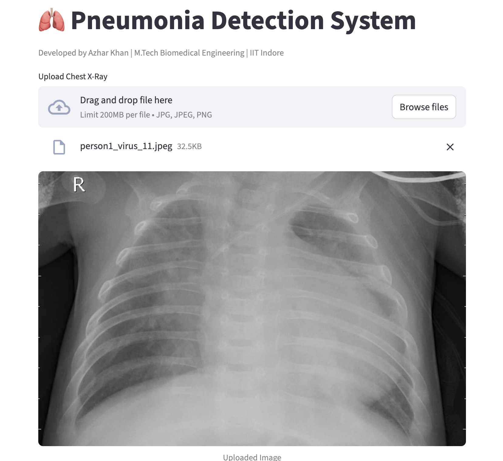

# 🫁 Pneumonia Detection System



A Deep Learning based web application for detecting pneumonia from Chest X-ray images using MobileNetV2, FastAPI, and Streamlit.

## 🚀 Live Application

### Streamlit Web App

https://pneumonia-detection-api-1-iaqe.onrender.com

### FastAPI Documentation

https://pneumonia-detection-api-8lh9.onrender.com/docs

---

## 📖 Project Overview

This project uses a Deep Learning model trained on Chest X-ray images to classify patients into:

* 🟢 NORMAL
* 🔴 PNEUMONIA

Users can upload a Chest X-ray image through a web interface and receive:

* Disease Prediction
* Confidence Score
* Real-Time Inference

The application is fully deployed on the cloud and accessible through a public URL.

---

## 🏗️ System Architecture

```text
User Uploads X-ray
        │
        ▼
 Streamlit Frontend
        │
        ▼
   FastAPI Backend
        │
        ▼
 TensorFlow Model
        │
        ▼
 Prediction + Confidence
```

---

## 🛠️ Technologies Used

### Machine Learning

* TensorFlow
* Keras
* MobileNetV2
* NumPy

### Backend

* FastAPI
* Uvicorn

### Frontend

* Streamlit

### Deployment

* Render
* GitHub

### Image Processing

* Pillow

---

## 📂 Project Structure

```text
Pneumonia Detection
│
├── api.py
├── streamlit_app.py
├── requirements.txt
├── Procfile
├── runtime.txt
│
├── models/
│   └── pneumonia_mobilenet.keras
│
├── train.py
├── train_mobilenet.py
├── predict.py
│
└── README.md
```

---

## ⚙️ Features

✅ Chest X-ray Upload

✅ Real-Time Prediction

✅ Confidence Score

✅ FastAPI REST API

✅ Streamlit Web Interface

✅ Cloud Deployment

✅ Public Access URL

---

## 📊 Model Details

| Parameter  | Value              |
| ---------- | ------------------ |
| Model      | MobileNetV2        |
| Input Size | 224 × 224          |
| Classes    | NORMAL, PNEUMONIA  |
| Framework  | TensorFlow / Keras |

---

## 🎯 Learning Outcomes

Through this project I gained hands-on experience in:

* Deep Learning for Medical Imaging
* TensorFlow & Keras
* Transfer Learning
* FastAPI Development
* Streamlit UI Development
* REST API Integration
* Cloud Deployment
* Git & GitHub Version Control

---

## 👨‍💻 Developer

**Azhar Khan**

M.Tech Biomedical Engineering

Indian Institute of Technology (IIT) Indore

GitHub:
https://github.com/azhar-khan-1

---

## ⚠️ Disclaimer

This application is intended for educational and research purposes only.

It should not be used as a substitute for professional medical diagnosis, treatment, or clinical decision-making.
